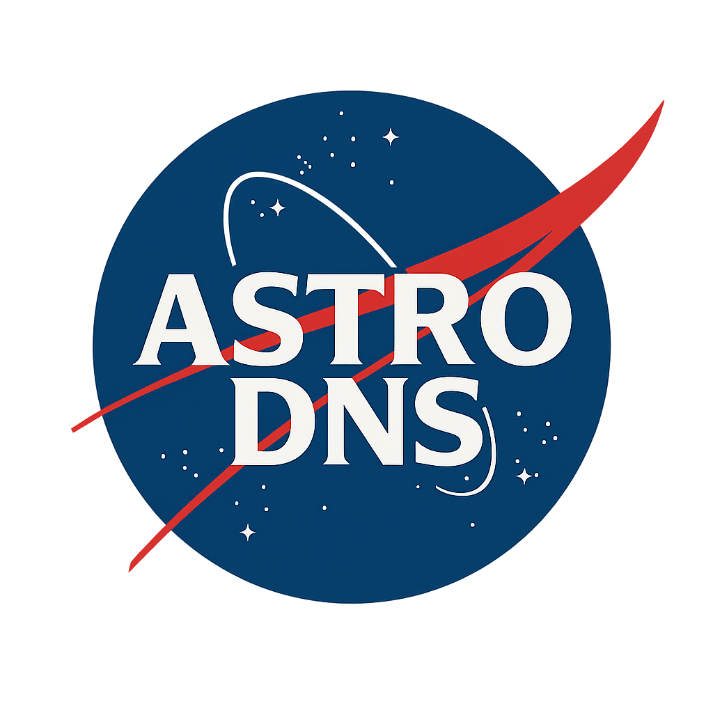
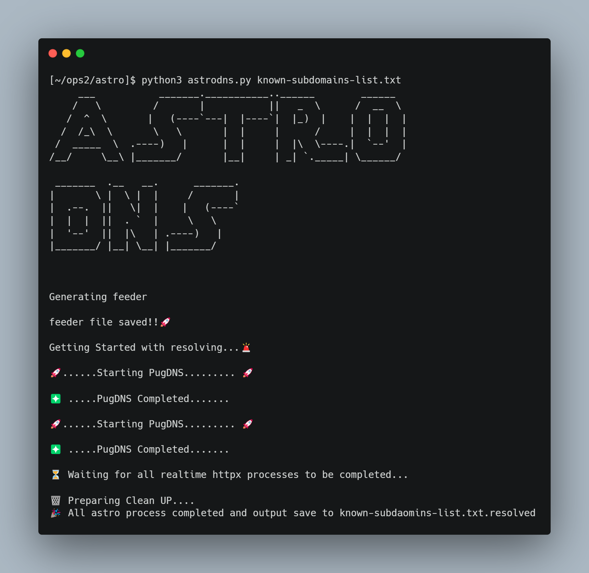

<p align="center"></p>

# About
**AstroDNS** is a high-performance subdomain brute-forcing automation tool that identifies brute-forceable locations within known list of subdomains using a set of predefined rules. AstroDNS processes domains in batches, filters out out-of-scope domains and poisoned DNS responses, runs httpx on the results across the top 30 ports, and notifies only when new subdomains are discovered.

AstroDNS uses [pugDNS](https://github.com/c3l3si4n/pugdns) fastest DNS resolver under the hood for resolving domains. With sufficient bandwidth, resources and a reliable list of public resolvers, it can resolve 1 million of domain within seconds. During testing PugDNS delivered more results then massDNS.

<p align="left"></p>

# Features
 - Identifies brute-forceable locations within known list of subdomains using a set of predefined rules.
 - Accepts wordlist for generating combinations and permutations according to scope.
 - Accepts multiple TLD domains eg: (gs.com, goldman.com)
 - Resolves generated subdomain list using PugDNS (yields more results than massDNS)
 - Allows customizing the batch size according to wordlist size and system resourcses.
 - Filters and parses PugDNS resolved domain to httpx (scans top 30 popular ports)
 - AstroDNS provides real-time notifications as soon as a new subdomain is discovered, even if the overall execution is still in progress.

# Predefined rules

| Known Subdomain | brute-forceable locations |
| :------ | :------- 
| black-uat.api.gs.com  | \*-black-uat.api.gs.com , \*-uat.api.gs.com , \*.api.gs.com , black-\*.api.gs.com , black-uat-\*.api.gs.com , black-uat.\*-api.gs.com, black-uat.\*.gs.com, black-uat.api-\*.gs.com |

# Installation
```
pip3 install -r requirements.txt
```
# Prerequisite
 - PugDNS     [https://github.com/c3l3si4n/pugdns]
 - httpx     [https://github.com/projectdiscovery/httpx]
 - Notify    [https://github.com/projectdiscovery/notify]
 - Jq


# How to use
- feed list of known sudomains (Allows multiple TLDs)
  
  ```
  python3 astrodns.py known-list-subdomain.txt
  ```
  
# Things to configure before runing
- Add resolvers.txt path. (if not provided AstroDNS will download trickest resolvers by default and save it in current directory)
- Add Notify provider config path.
- Add your wordlist url (AstroDNS is configured in such a way that it downloads wordlist in every run and then deletes it. if not provided it will use n0kovo sudomain wordlist by default)
- The script generates all possible three-letter combinations (a–z), which includes common subdomain patterns like api, dev, stg, uat, and pip. For more comprehensive coverage, you can modify it to generate 4-letter combinations. If you prefer not to use this feature, simply disable it by commenting out the corresponding function call.
- AstroDNS processes generated brute-forceable subdomains in batches to minimize memory usage and prevent crashes. By default, the batch size is set to 4, but it can be adjusted based on the size of your wordlist. For example, with a batch size of 4 and a wordlist containing N entries, AstroDNS will attempt to resolve 4 × N subdomains per batch using PugDNS. In typical environments (e.g., 6GB RAM, 4 CPU cores), a batch size of 4 works reliably and efficiently.
- AstroDNS queues all httpx processes to conserve system resources and give more power to PugDNS. As a result, only one httpx process is executed per batch to get you notified if any new domain is found in realtime even the execution of Astro is not completed. You may notice a delay during the final step, where AstroDNS waits for all queued httpx processes to complete.

# Personal Note
I made this AstroDNS to automate resolving based on my rules and using pugdns tool for resolving in thunder speed. Please edit the script according to your needs (there could be more better ways to highly optimize the script)

Credits to all infosec tools mentioned above in Prerequisite section.
